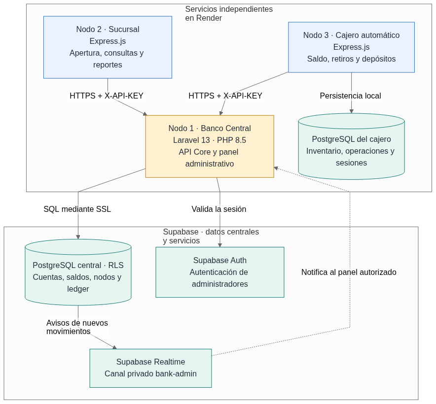
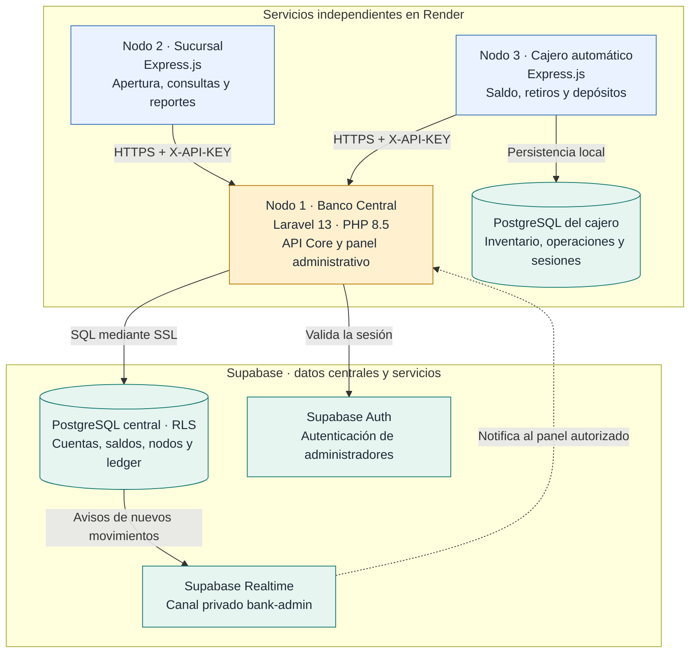
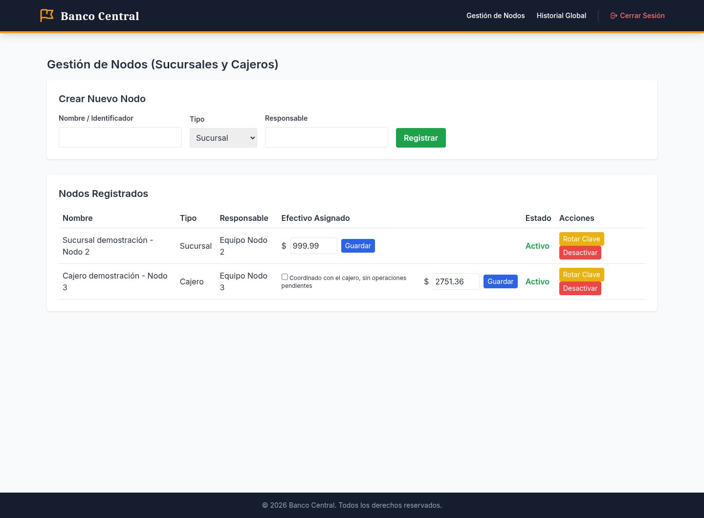
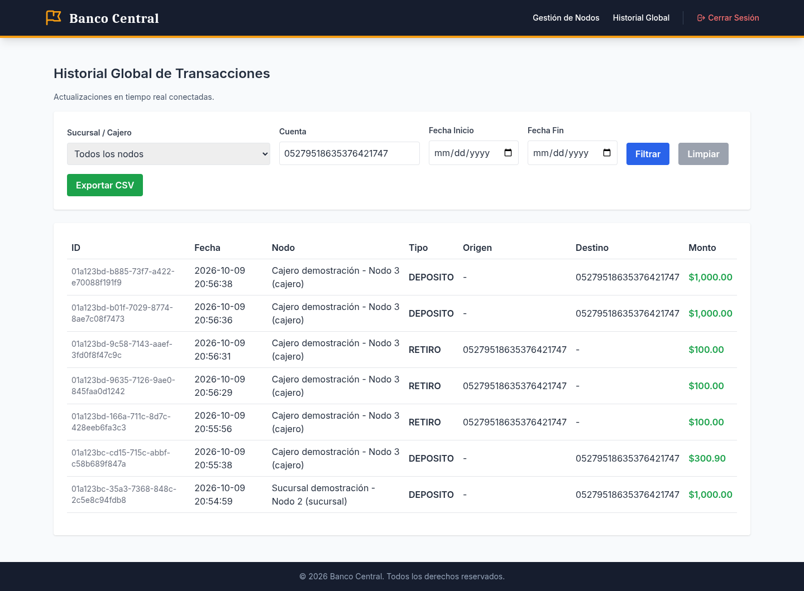
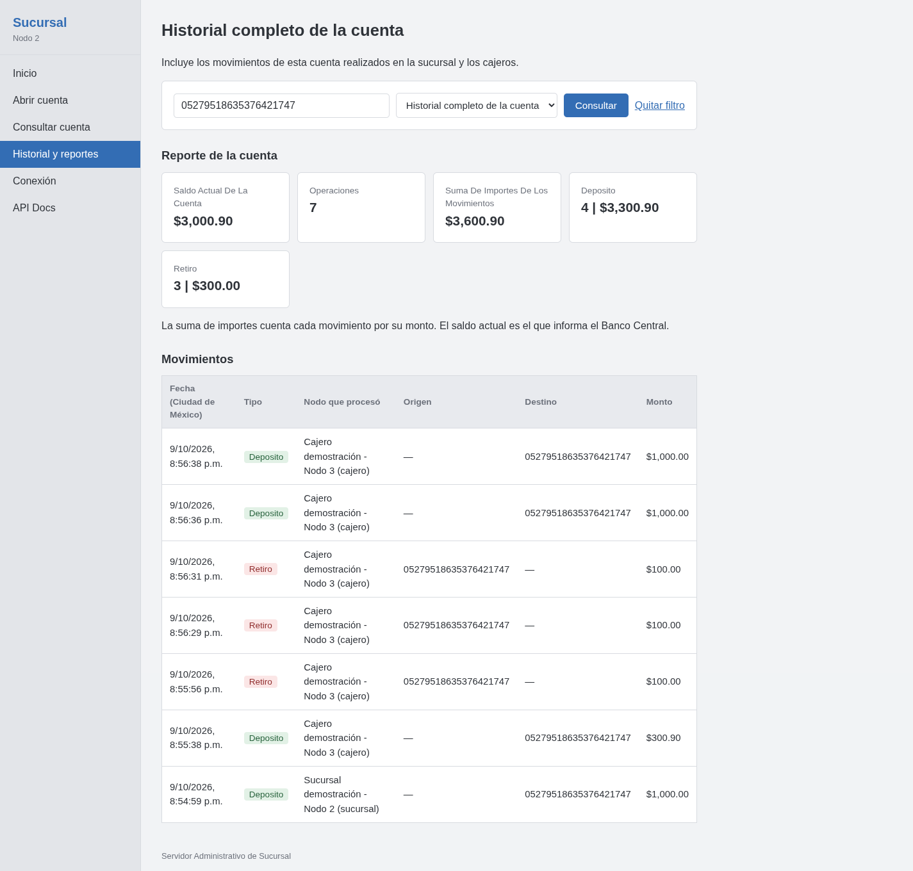
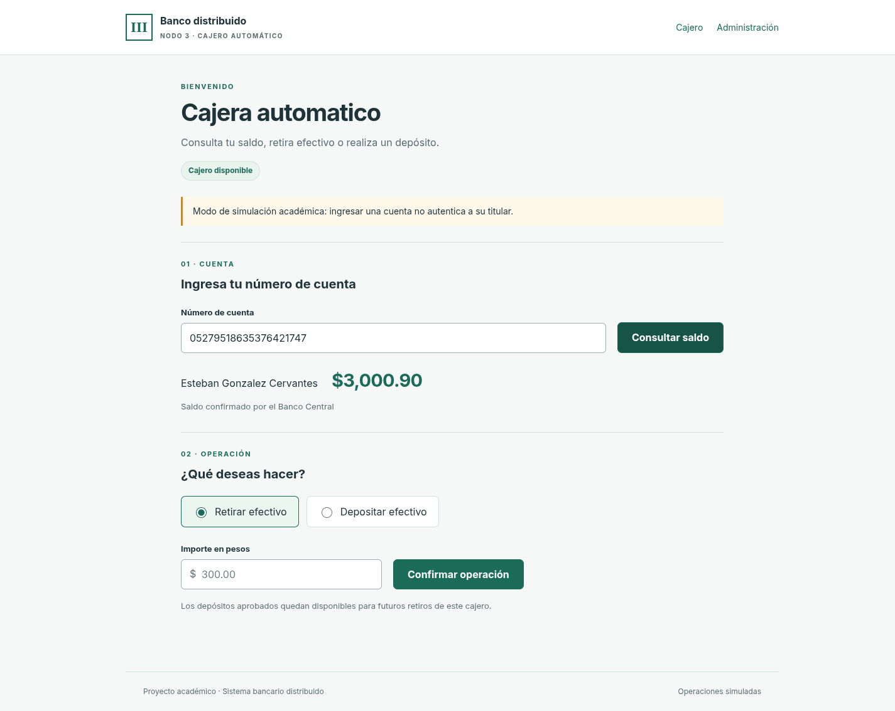

# Sistema Bancario Distribuido — Nodo 1: Banco Central

**Examen práctico 2 · Tópicos de Programación Web.** Este repositorio contiene el Banco Central del sistema: una API en Laravel y un panel administrativo que consolidan las cuentas, los saldos y las transacciones en Supabase. La sucursal y el cajero funcionan como servicios independientes y se comunican con el Central mediante HTTPS y una API Key propia.

[Documentación general de los tres nodos, sin capturas del sistema](README_DOCUMENTACION.md).

## Aplicaciones y repositorios

Se entrega **un repositorio por cada nodo**. Los tres servicios están desplegados en Render, conforme a la aclaración del profesor; Vercel y Coolify quedaron como opciones adicionales.

| Nodo | Repositorio de código | Aplicación desplegada | Contrato OpenAPI |
| --- | --- | --- | --- |
| **1 · Banco Central** | [GitHub Nodo 1](https://github.com/Shinra3245/EXAMEN_2_TOPWEB_NODO_1) | [Panel del Central](https://banco-central-nodo1.onrender.com/admin/login) | [openapi.yaml](openapi.yaml) |
| **2 · Sucursal** | [GitHub Nodo 2](https://github.com/Shinra3245/EXAMEN_2_TOPWEB_NODO_2) | [Sucursal](https://sucursal-nodo2.onrender.com) | [OpenAPI de sucursal](https://github.com/Shinra3245/EXAMEN_2_TOPWEB_NODO_2/blob/main/docs/openapi.yaml) |
| **3 · Cajero automático** | [GitHub Nodo 3](https://github.com/Shinra3245/EXAMEN_2_TOPWEB_NODO_3/tree/main) | [Cajero](https://node3-atm.onrender.com) | [OpenAPI del cajero](https://github.com/Shinra3245/EXAMEN_2_TOPWEB_NODO_3/blob/main/openapi.json) |

La API del Central tiene como base `https://banco-central-nodo1.onrender.com/api`. El [panel técnico del cajero](https://node3-atm.onrender.com/admin/login) permite configurar su conexión. Los accesos administrativos usan las credenciales privadas proporcionadas al equipo.

## Diagrama de arquitectura



La sucursal y el cajero solicitan operaciones al Banco Central. Laravel valida la API Key y confirma los cambios de saldo y el registro de la transacción de forma atómica. Supabase PostgreSQL conserva el saldo global y el historial; el PostgreSQL propio del cajero conserva su efectivo local, sus comprobantes y sus sesiones. Supabase Auth valida a los administradores y Realtime avisa al panel mediante un canal privado.

<details>
<summary>Ver el diagrama en Mermaid</summary>



</details>

[Fuente editable del diagrama](evidencias/arquitectura_bancaria.mmd).

## Módulos y estructura del Nodo 1

```text
EXAMEN_2_TOPWEB_NODO_1/
├── app/
│   ├── Console/Commands/          # Alta inicial de administradores
│   ├── Http/Controllers/
│   │   ├── Admin/                # Acceso, nodos, efectivo, reportes y Realtime
│   │   └── Api/                  # Cuentas, transacciones y comprobantes ATM
│   ├── Http/Middleware/          # Autenticación administrativa y por API Key
│   └── Models/                   # BankNode, UserAccount y Transaction
├── config/                       # Conexión PostgreSQL y servicios de Supabase
├── database/migrations/          # Esquema y ampliaciones incrementales
├── supabase/                     # SQL de tablas, restricciones y RLS
├── resources/views/admin/        # Panel de nodos, acceso e historial global
├── public/                       # Entrada web y cliente de Realtime
├── routes/
│   ├── api.php                   # API protegida para sucursal y cajero
│   └── web.php                   # Rutas del panel administrativo
├── tests/Feature/                # Pruebas bancarias, permisos y concurrencia
├── evidencias/                   # Capturas y resultados de validación
├── openapi.yaml                  # Contrato de la API del Central
├── postman_integracion_collection.json
├── postman_integracion_environment.json
├── Dockerfile                    # PHP 8.5, Apache y extensiones PostgreSQL
├── docker-entrypoint.sh          # Cachés, migraciones incrementales y arranque
├── render.yaml                   # Servicio y despliegue continuo en Render
├── test-postgres.sh              # Pruebas en PostgreSQL aislado
└── README.md                     # Documentación principal de entrega
```

| Módulo | Funcionalidades implementadas |
| --- | --- |
| **Administración del banco** | Acceso con Supabase Auth; registro de sucursales y cajeros; responsables, estado, API Keys y efectivo asignado. |
| **Cuentas** | Apertura desde la sucursal, consulta del saldo global y estado de la cuenta. |
| **Operaciones bancarias** | Depósitos, retiros y transferencias; validación de fondos, bloqueo de cuentas e idempotencia. |
| **Integración ATM** | Efectivo central y local coordinados, comprobantes durables y recuperación de operaciones sin duplicarlas. |
| **Historial y reportes** | Historial global por nodo, cuenta y fechas; exportación CSV; historial local y consulta completa por cuenta autorizada. |
| **Seguridad y Realtime** | API Keys almacenadas como hashes SHA-256, RLS, ledger inmutable y notificaciones privadas para administradores. |

### Datos centrales

| Tabla | Información que conserva |
| --- | --- |
| `bank_admins` | Administradores autorizados vinculados con Supabase Auth. |
| `bank_nodes` | Sucursales y cajeros, responsables, efectivo, estado y hash de su API Key. |
| `users_accounts` | Número de cuenta, titular, saldo global, estado y sucursal de apertura. |
| `transactions` | Movimientos confirmados, nodo que los procesó, cuentas, monto, tipo y fecha. |
| `atm_operation_results` | Comprobantes y rechazos durables para recuperar intentos del cajero. |

## Imágenes del sistema

Las siguientes capturas corresponden a las aplicaciones reales desplegadas. Los importes muestran el estado de las cuentas y nodos de prueba al momento de la captura.

### Banco Central: gestión de sucursales y cajeros

El panel permite registrar nodos, asignar responsables y efectivo, y administrar sus accesos.



### Banco Central: historial global y reportes

La consulta filtrada por cuenta reúne los siete movimientos realizados por sucursal y cajero. Incluye el nodo de origen, las fechas, los importes, la exportación CSV y el estado de conexión de Realtime.



### Sucursal: historial completo de la cuenta

La sucursal distingue su historial local del historial completo de una cuenta. Muestra **$3,000.90** de saldo actual y siete movimientos; la suma de importes se presenta por separado.



### Cajero: consulta del saldo central

La consulta de la misma cuenta devuelve **$3,000.90**, coincidente con el Banco Central y la sucursal.



## API y documentación de integración

Las rutas bancarias requieren la cabecera `X-API-KEY`. Las cuentas nuevas solo pueden abrirse desde una sucursal; cada operación conserva su clave de idempotencia al reintentarse.

| Método | Ruta, relativa a `/api` | Función |
| --- | --- | --- |
| `GET` | `/nodes/me` | Identidad, estado y efectivo del nodo autenticado. |
| `POST` | `/accounts` | Apertura de una cuenta desde la sucursal. |
| `GET` | `/accounts/{numero_cuenta}` | Consulta de cuenta y saldo global. |
| `POST` | `/transactions` | Depósito, retiro o transferencia. |
| `GET` | `/transactions` | Historial local del nodo, filtrable por cuenta. |
| `GET` | `/accounts/{numero_cuenta}/transactions` | Historial completo de la cuenta para la sucursal que la abrió. |
| `GET` | `/transactions/by-idempotency-key/{key}` | Recuperación del comprobante del cajero autenticado. |

- [Contrato OpenAPI del Central](openapi.yaml).
- [Conexión de los nodos a Supabase mediante el Central](CONEXION_SUPABASE_NODOS.md).
- [Contrato específico del cajero](CONTRATO_NODO3.md).
- [Colección conjunta de Postman](postman_integracion_collection.json), [entorno sin credenciales](postman_integracion_environment.json) y [flujo de validación](FLUJO_POSTMAN.md).
- [Consultas Postman del historial completo y local](postman_historial_collection.json).

## Instalación del Banco Central

Se utiliza Laravel 13, PHP 8.5, Composer 2 y PostgreSQL de Supabase. PHP necesita las extensiones `pdo_pgsql`, `mbstring` y `bcmath`; el [Dockerfile](Dockerfile) las instala para Render.

```bash
git clone https://github.com/Shinra3245/EXAMEN_2_TOPWEB_NODO_1.git
cd EXAMEN_2_TOPWEB_NODO_1
composer install
cp .env.example .env
php artisan key:generate
```

Configurar `.env` con las credenciales del proyecto Supabase y los siguientes valores:

```dotenv
APP_NAME=BancoCentral
APP_ENV=local
APP_URL=http://localhost:8000

DB_CONNECTION=pgsql
DB_HOST=HOST_DEL_SESSION_POOLER
DB_PORT=5432
DB_DATABASE=postgres
DB_USERNAME=postgres.REFERENCIA_DEL_PROYECTO
DB_PASSWORD=CONTRASENA_PRIVADA
DB_SSLMODE=require

SUPABASE_URL=https://REFERENCIA_DEL_PROYECTO.supabase.co
SUPABASE_PUBLISHABLE_KEY=CLAVE_PUBLICABLE_DEL_PROYECTO
SUPABASE_SECRET_KEY=CLAVE_SECRETA_DEL_SERVIDOR

SESSION_DRIVER=cookie
CACHE_STORE=file
QUEUE_CONNECTION=sync
```

Con la conexión configurada, aplicar las migraciones incrementales y arrancar Laravel:

```bash
php artisan migrate
php artisan serve
```

Para un proyecto nuevo, el comando `php artisan admin:create-initial CORREO CONTRASENA` registra al primer administrador en Supabase Auth y en `bank_admins`. El panel local se abre en `http://localhost:8000/admin/login`.

Los valores reales de `.env`, contraseñas, API Keys y sesiones se conservan fuera de Git. En una base existente se aplican migraciones incrementales; no se ejecuta `migrate:fresh` ni se repite el SQL inicial.

## Despliegue y validaciones realizadas

[render.yaml](render.yaml) declara el servicio Docker y el despliegue automático al actualizar `main`. [docker-entrypoint.sh](docker-entrypoint.sh) genera las cachés, aplica migraciones incrementales y arranca Apache. La configuración completa está en [DESPLIEGUE_RENDER.md](DESPLIEGUE_RENDER.md).

| Validación técnica registrada | Resultado |
| --- | --- |
| Banco Central con PostgreSQL aislado | **51 pruebas y 318 aserciones aprobadas**, incluidas pruebas HTTP de concurrencia. |
| Integración de los tres nodos en Render | **46 solicitudes Postman y 49 aserciones aprobadas**, incluida persistencia tras reiniciar el cajero. |
| Historial completo y local de la cuenta | **13 consultas Postman y 27 aserciones aprobadas**, sin realizar operaciones monetarias. |

Para ejecutar las pruebas del Central en una base aislada:

```bash
sh test-postgres.sh
```

Este script utiliza contenedores de prueba y no las credenciales de Supabase. Se verifican permisos, idempotencia, fondos y efectivo insuficientes, transferencias, historial inmutable, paginación y concurrencia.

Resultados: [integración conjunta](evidencias/ensayo_entrega_postman.json), [historial por cuenta](evidencias/historial_cuenta_postman.json) y [verificación de Realtime](evidencias/nodo3_realtime_panel.json). El flujo de integración registrado fue apertura de **$1,000**, retiro de **$300** y saldo final de **$700**.

## Entregables y demostración

Este repositorio entrega el código del Nodo 1 con sus módulos identificados, el README con el diagrama de arquitectura, las imágenes del sistema, los enlaces a los tres repositorios y aplicaciones, y los contratos OpenAPI. La documentación complementaria está en [ENTREGA_FINAL.md](ENTREGA_FINAL.md).

**La demostración en vivo está pendiente y se realizará posteriormente, cuando indique el profesor.** Las pruebas y capturas documentadas corresponden a validaciones técnicas previas; no sustituyen la exposición del equipo.
