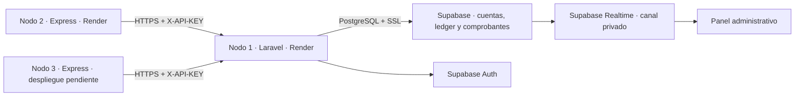

# EXAMEN 2 TOPWEB: NODO 1 (Banco Central)

Este repositorio contiene la implementación del Nodo 1 (Banco Central) del Sistema Bancario Distribuido.

## Arquitectura

El Nodo 1 es una API construida con **Laravel 13** que se conecta a una base de datos central en **Supabase** (PostgreSQL). Utiliza **Supabase Auth** para la autenticación del panel y **Supabase Realtime** para avisar de nuevos movimientos mediante un canal privado autorizado por RLS.

- **Framework**: Laravel 13
- **Base de Datos**: PostgreSQL en Supabase, con seguridad RLS a nivel de tablas.
- **Autenticación**: Supabase Auth para usuarios administradores; API Keys hasheadas con SHA-256 para nodos sucursales y cajeros.
- **Operaciones Atómicas**: Se usa `DB::transaction()` con bloqueo pesimista (`lockForUpdate`) para garantizar la consistencia en depósitos y retiros.
- **Idempotencia**: Las transacciones usan `idempotency_key` para evitar transferencias o retiros duplicados ante problemas de red.



## Configuración e Instalación

### 1. Clonar el repositorio
```bash
git clone https://github.com/Shinra3245/EXAMEN_2_TOPWEB_NODO_1.git
cd EXAMEN_2_TOPWEB_NODO_1
```

### 2. Archivo de configuración (.env)
Copia el archivo de ejemplo:
```bash
cp .env.example .env
```
Añade tus variables secretas (deberás tener las credenciales de Supabase). El `.env` debe lucir así para producción:
```env
DB_CONNECTION=pgsql
DB_HOST=aws-0-us-east-1.pooler.supabase.com
DB_PORT=5432
DB_SSLMODE=require
DB_DATABASE=postgres
DB_USERNAME=postgres.tu-proyecto
DB_PASSWORD=TU_CONTRASEÑA

SUPABASE_URL=https://tu-proyecto.supabase.co
SUPABASE_SECRET_KEY=sb_secret_tu_clave
SUPABASE_PUBLISHABLE_KEY=sb_publishable_tu_clave
```

### 3. Instalar dependencias
```bash
composer install
```

### 4. Crear el administrador inicial
Ejecuta este comando usando la API de Supabase para registrar el primer administrador:
```bash
php artisan admin:create-initial admin@banco.com tu-contraseña-segura
```

### 5. Arranque
Para pruebas locales (sin docker):
```bash
php artisan serve
```

---

## Pruebas (Test Driven)

Las pruebas deben ejecutarse contra PostgreSQL aislado en Docker. No utilizar las credenciales de Supabase para las pruebas: contienen operaciones de recreación de tablas.

Para ejecutar las pruebas localmente:
```bash
sh test-postgres.sh
```
Se verifican cuentas, idempotencia, fondos insuficientes, transferencias, ledger inmutable y compatibilidad del panel con el esquema real. La prueba HTTP de concurrencia requiere un servidor aislado que comparta exclusivamente la base de pruebas.

---

## Integración y API (Postman / OpenAPI)

El sistema expone endpoints seguros. Encuentra el contrato en:
- `openapi.yaml` (Definición completa Swagger/OpenAPI)
- `postman_collection.json` (Colección lista para importar)
- `postman_environment.json` (Variables de entorno para Postman)

El flujo típico de un Nodo (Sucursal/Cajero) es:
1. El Administrador Central crea el nodo en el panel (`/admin`).
2. Se genera una `X-API-KEY` (sólo mostrada 1 vez).
3. El Nodo envía esta cabecera en peticiones a `/api/accounts` y `/api/transactions`.

---

## Despliegue

Render es el destino acordado con el profesor. Vercel y Coolify son opcionales. El servicio usa Docker, PHP 8.5, el pooler de sesión de Supabase y variables privadas de Render. Consulte [DESPLIEGUE_RENDER.md](DESPLIEGUE_RENDER.md) para configuración, migraciones, validación y actualización.

La colección conjunta se entrega en `postman_integracion_collection.json`, con el entorno `postman_integracion_environment.json` y las instrucciones en [FLUJO_POSTMAN.md](FLUJO_POSTMAN.md). El Nodo 2 ya está publicado en [Render](https://sucursal-nodo2.onrender.com). La prueba conjunta con la aplicación del Nodo 3 espera su URL. El contrato del cajero y la colección específica están en [CONTRATO_NODO3.md](CONTRATO_NODO3.md).

Publicado y verificado: [Banco Central](https://banco-central-nodo1.onrender.com) · [Panel administrativo](https://banco-central-nodo1.onrender.com/admin/login). La ampliación del contrato ATM cuenta con 41 pruebas PostgreSQL aisladas (269 aserciones), incluidas tres pruebas HTTP de concurrencia real. La validación inicial en Render registró 27 aserciones Postman sin fallos. El historial de la API está limitado al nodo que procesó cada operación. Evidencia: [VALIDACION_RENDER.md](evidencias/VALIDACION_RENDER.md).

## Historial y efectivo

El panel filtra por nodo, cuenta y fechas inclusivas en America/Mexico_City; conserva filtros al paginar y exportar CSV. Para ajustar efectivo del cajero, coordinar con su responsable sin pendientes y usar la página actual: se rechaza un formulario cuyo efectivo anterior ya cambió. Los retiros/depósitos nuevos del cajero actualizan efectivo central atómicamente.

Las ampliaciones utilizan migraciones incrementales; no volver a ejecutar `supabase/001_schema.sql` en una base existente. Los comprobantes ATM se guardan aparte del ledger inmutable y no se borran para permitir recuperación tras reinicios.
