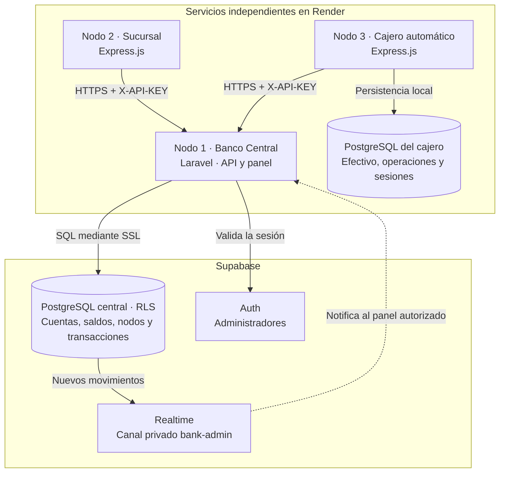

# Documentación del Sistema Bancario Distribuido

**Examen práctico 2 · Tópicos de Programación Web.** El sistema integra un Banco Central, una sucursal y un cajero automático. Cada nodo tiene su propio repositorio y servicio en Render. Este documento describe la arquitectura, los módulos y la integración de los tres nodos.

## Repositorios y aplicaciones

| Nodo | Repositorio de código | Aplicación |
| --- | --- | --- |
| **1 · Banco Central** | [EXAMEN_2_TOPWEB_NODO_1](https://github.com/Shinra3245/EXAMEN_2_TOPWEB_NODO_1) | [Panel administrativo](https://banco-central-nodo1.onrender.com/admin/login) |
| **2 · Sucursal** | [EXAMEN_2_TOPWEB_NODO_2](https://github.com/Shinra3245/EXAMEN_2_TOPWEB_NODO_2) | [Sucursal](https://sucursal-nodo2.onrender.com) |
| **3 · Cajero automático** | [EXAMEN_2_TOPWEB_NODO_3 · rama main](https://github.com/Shinra3245/EXAMEN_2_TOPWEB_NODO_3/tree/main) | [Cajero](https://node3-atm.onrender.com) |

**Render es la plataforma principal de despliegue**, conforme a la indicación del profesor. Vercel y Coolify son alternativas opcionales. El Nodo 3 se entrega desde la rama `main`, que contiene la versión integrada.

## Diagrama de arquitectura

El Banco Central conserva el saldo global y confirma cada operación junto con su registro de transacción. La sucursal y el cajero consumen su API mediante HTTPS; sus claves identifican al nodo y determinan sus permisos. El cajero mantiene una base PostgreSQL propia para conservar el efectivo disponible, las operaciones y las sesiones de su panel técnico.

## Módulos del proyecto

| Nodo | Tecnología | Funciones principales |
| --- | --- | --- |
| **Banco Central** | Laravel 13, PHP 8.5 y Supabase | Administración de nodos, responsables, API Keys y efectivo; cuentas y saldos; depósitos, retiros y transferencias; historial global, reportes CSV y avisos de Realtime. |
| **Sucursal** | Node.js, Express y EJS | Apertura y consulta de cuentas; historial local y completo por cuenta autorizada; reportes y comprobación de conexión con el Central. |
| **Cajero** | Node.js, Express y PostgreSQL | Consulta de saldo, depósitos y retiros; control de efectivo local, comprobantes, recuperación de operaciones y configuración desde un panel técnico. |

### Estructura de los repositorios

| Repositorio | Directorios y archivos principales |
| --- | --- |
| **Nodo 1** | `app/` contiene controladores, middleware y modelos; `routes/`, las rutas web y API; `resources/views/admin/`, el panel; `database/migrations/` y `supabase/`, el esquema; `tests/Feature/`, las pruebas; `openapi.yaml`, el contrato; `Dockerfile` y `render.yaml`, el despliegue. |
| **Nodo 2** | `controllers/`, los controladores web y API; `routes/`, las rutas; `services/`, la conexión con el Central y los reportes; `middlewares/`, el manejo de errores; `views/`, las pantallas; `test/`, las pruebas; `docs/openapi.yaml`, el contrato; `render.yaml`, el despliegue. |
| **Nodo 3** | `src/`, el cliente del Central, servicio ATM, configuración, seguridad y persistencia; `views/` y `public/`, la interfaz; `scripts/`, la preparación y migración de la base local; `test/`, las pruebas; `openapi.json`, el contrato; `render.yaml`, el despliegue. |

## Integración y reglas de operación

La API central tiene como base `https://banco-central-nodo1.onrender.com/api`. Las solicitudes de los nodos requieren la cabecera `X-API-KEY`.

1. La sucursal solicita la apertura de una cuenta al Central.
2. El Central registra la cuenta y su saldo; las operaciones posteriores actualizan ese saldo y generan una transacción de forma atómica.
3. El cajero consulta el saldo central antes de operar y coordina los movimientos con su efectivo disponible.
4. Las claves de idempotencia permiten recuperar o reintentar una operación sin duplicar movimientos.
5. Los historiales locales muestran las operaciones del nodo autenticado. La sucursal que abrió una cuenta puede consultar además su historial completo, incluidos los movimientos realizados en el cajero.

El saldo actual de la cuenta se presenta por separado de la suma de importes del reporte. El registro central de transacciones es inmutable. Las API Keys se guardan como hashes en el Central; las credenciales de conexión se configuran en variables de entorno y se proporcionan al equipo por separado.

## Contratos y configuración

- [OpenAPI del Banco Central](openapi.yaml).
- [OpenAPI de la sucursal](https://github.com/Shinra3245/EXAMEN_2_TOPWEB_NODO_2/blob/main/docs/openapi.yaml).
- [OpenAPI del cajero](https://github.com/Shinra3245/EXAMEN_2_TOPWEB_NODO_3/blob/main/openapi.json).
- [Conexión de los nodos al Banco Central y Supabase](CONEXION_SUPABASE_NODOS.md).
- [Contrato de integración del cajero](CONTRATO_NODO3.md).
- [Configuración y despliegue del Central en Render](DESPLIEGUE_RENDER.md).
- [Instalación del Nodo 1](README.md#instalación-del-banco-central), [Nodo 2](https://github.com/Shinra3245/EXAMEN_2_TOPWEB_NODO_2/blob/main/README.md) y [Nodo 3](https://github.com/Shinra3245/EXAMEN_2_TOPWEB_NODO_3/blob/main/README.md).

Los paneles administrativos del Central y del cajero requieren las credenciales privadas entregadas al equipo. El [panel técnico del cajero](https://node3-atm.onrender.com/admin/login) permite revisar su configuración de conexión.

## Validación técnica

Las pruebas registradas cubren la comunicación entre los tres nodos, permisos, cuentas, saldos, fondos y efectivo insuficientes, idempotencia, recuperación de operaciones e historial.

- [Colección conjunta de Postman](postman_integracion_collection.json), [entorno sin credenciales](postman_integracion_environment.json) y [flujo de ejecución](FLUJO_POSTMAN.md).
- [Colección de consultas del historial completo y local](postman_historial_collection.json).
- [Resultados de integración](evidencias/ensayo_entrega_postman.json) y [resultados del historial por cuenta](evidencias/historial_cuenta_postman.json).

El flujo técnico documentado verificó una apertura de **$1,000**, un retiro de **$300** y un saldo final de **$700**. También se verificó que el historial completo de una cuenta incluye los movimientos del cajero y que el historial local conserva el filtro por nodo.

## Entregables del examen

Se proporciona un repositorio de código por nodo, su estructura de módulos, este README con el diagrama de arquitectura, los enlaces a las aplicaciones y los contratos OpenAPI. La información complementaria está en [ENTREGA_FINAL.md](ENTREGA_FINAL.md).

**La demostración en vivo queda pendiente y se realizará cuando indique el profesor.** Las validaciones técnicas registradas no sustituyen esa exposición.
